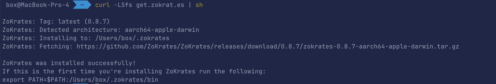
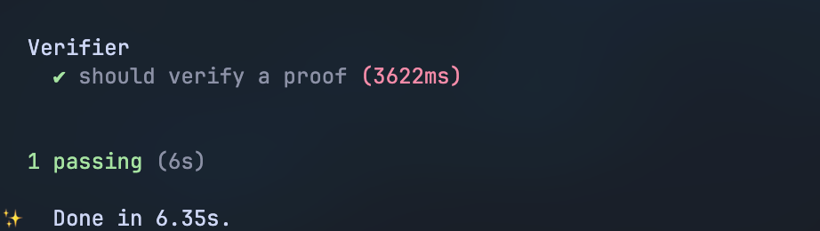

# zk-SNARKs 在 Solidity 中的使用

文章作者:[@BoxMrChen](https://twitter.com/BoxMrChen)，欢迎转载，转载请注明出处。
文章 Github 仓库: https://github.com/nishuzumi/blog，欢迎 Star。如果文章有误，欢迎提 PR。
进入交流群：欢迎添加个人微信`Im3boxtech`，备注`进群`，我会拉你进入交流群。

本文章主要讲述了如何在 Solidity 中使用 zk-SNARKs，以及如何使用 ZoKrates 编译器来生成证明和验证合约。

这文章不会过于深入 zk-SNARKs 的技术原理，这文章目的是为让读者能够理解 sk-SNARKs 的技术能在 EVM 中达到什么效果，如何使用，并且能在代码中运用。

## zk-SNARKs 简介

关于 zk-SNARKs 的简短描述为，我们需要在 zk 电路中编写一段代码，这段代码的输入是一些公开的数据，输出是一些私有的数据。zk-SNARKs 的验证算法可以验证这段代码的输出是否正确，但是验证算法不会泄露任何私有数据。而 Solidity 合约的主要目的是验证 zk-SNARKs 的验证算法的结果，如果验证算法的结果正确，那么合约会执行一些操作。

也就是说，在 EVM 上，只是进行了结果的验证，并没有进行一些复杂的计算，这些计算都是在 zk 电路中进行的。而这部分 zk 电路，则是在链下进行的，然后将结果提交到链上。

## 在 Solidity 中使用 zk-SNARKs

首先，我们需要知道 zk-SNARKs 可以完成什么功能，其实很简单，我们可以简单的认为，zk-SNARKs 可以完成对一个函数运算结果的校验，比如说，我们有一个函数，输入是三个数字，输出是一个数字，我们可以使用 zk-SNARKs 来校验这个函数的输出是否正确。但是我们并不需要知道输入的三个数字是什么，只需要知道这个函数的输出即可，也就是说，在一个函数完成计算时，我们可以知道确实是有这么三个数他能符合这个函数的输入，并且能输出正确结果，但是我们并不知道这三个数是什么。

在 Solidity 中，我们可以使用 zk-SNARKs 来完成对一个函数的校验，但是我们需要知道这个函数的输入和输出，然后我们可以使用 ZoKrates 编译器来生成 zk 电路，然后将 zk 电路的代码放到 Solidity 合约中，然后在合约中完成对 zk 电路的验证。

### 安装 ZoKrates 编译器

安装 [ZoKrates](https://github.com/Zokrates/ZoKrates)

```bash
curl -LSfs get.zokrat.es | sh
```

也可以选择其他安装方式，具体选择查看他们的 Github 页面。



### 编写 zk 电路

从上一章节我们浅显的知道，一个 zk-SNARKs 电路需要的最基本的东西为：

- 一个函数 - 我们需要有一个函数对数据进行运算，也就是程序 C
- lambda - 所谓的“有毒废料”，其实就是一个 root key，我们需要通过它来生成 pk 和 vk

有了这两个基础条件，用户就可以通过 pk，目标值，输入值来生成证明 w。  
随后，我们的验证程序通过 vk，目标值，证明 w 来验证证明的正确性。

我们先假设有这么一个第三方，他可以安全的生成 lambda，然后安全的将程序和 lambda 进行运算生成 vk 和 pk。

那么现在有两个新的角色，user 和 project。user 是用户，他确确实实拥有着一些数据，project 是项目合约，他需要验证用户的数据是否正确。

### 一个函数

我们首先需要一个函数，但是我并不打算举一些简单例子，因为我觉得这样做非常没有意义，因为 zk-SNARKs 的主要目的是为了验证一些复杂的函数，而不是一些简单的函数。

比如，我们现在需要生成一个存款凭证，有这个凭证，我们可以在任何地方取出这笔钱，但是我们并不知道这笔钱是谁的，我们只知道这笔钱是谁存的，存了多少，以及存款的时间。

首先我们需要一个存款函数，这个函数的输入为存款的金额，和一个随机数，然后输出为一个存款凭证。任何拥有这个凭证的人都可以取出这笔资金。所以，实际上，我们只需要编写验证知道这个凭证的验证函数即可。

```zok
import "hashes/sha256/512bit" as sha256;
import "utils/pack/u32/nonStrictUnpack256" as unpack256;

// deposit_amount: 存款金额
// secret: 随机数
// returns: 用于取款的commitment
def main(field deposit_amount, private field secret) -> u32[8] {
    return sha256(unpack256(deposit_amount), unpack256(secret));
}
```

关于 Zok 的语法和用法这里不过多描述，具体可以参考官网，这里简单解释一下，这个函数的输入为两个数字，一个是存款金额，一个是随机数，然后输出为一个 u32[8]，实际上就是 uint256.同时我们注意一下，参数中 deposit_amount 没有 private 关键词，说明这个参数是公开数据。

### 编译文件

这部分内容在 zokrates 中有讲述方式为

```zok
# compile
zokrates compile -i deposit.zok
# perform the setup phase
zokrates setup
# execute the program
zokrates compute-witness -a 337 113569
# generate a proof of computation
zokrates generate-proof
# export a solidity verifier
zokrates export-verifier
# or verify natively
zokrates verify
```

运行完成后会生成一堆文件，我们需要的是 proof.json, proving.key, verification.key, verifier.sol, out。

大部分其实都是模版文件生成文件可能不一样的地方在于 Verifier 合约中 verifyingKey，当然，我们阅读这个文件其实意义也不大，因为这里面全是一大堆数字和运算。
实际上我们需要看的内容就是这些 ∑

```solidity
function verifyTx(
        Proof memory proof, uint[8] memory input
    ) public view returns (bool r) {
    uint[] memory inputValues = new uint[](8);

    for(uint i = 0; i < input.length; i++){
        inputValues[i] = input[i];
    }
    if (verify(inputValues, proof) == 0) {
        return true;
    } else {
        return false;
    }
}
```

可以看到，我们需要两个参数,proof 和 input。至于这两个参数是干嘛的，我们暂时不过多深究。不过我们需要注意的是，在 inputs 中，所有的共有参数都会被加入到这个数组中，在数字最开头部分被推入。

比如，自动生成的 proof.json 文件就是一个有效的数据。

```json
{
  "scheme": "gm17",
  "curve": "bn128",
  "proof": {
    "a": [
      "0x05a83e3c3b3ff9d59bdffdcf7aa655f42b941b0063f82cf26516846056d09aa6",
      "0x018039b7de92979ef6251c877971888ae049d09a6b48e5aa98c23ef91550ed36"
    ],
    "b": [
      [
        "0x1e88e783456a27e4f02dde8c742610339e395eb0bbf7f7efc1113815dcf0a16f",
        "0x1cc9de9e60c6519ea69c9b3a71c0809ac7ae3389a598d66fc27d378738d5de29"
      ],
      [
        "0x0715544abbc18e741620ff7c76cb2a7d3558ee157d23f275ab65c43c25357d07",
        "0x0344257236ba33a3ce7ce34b8d518f7572984036db6f77fc2fc13f51c548a837"
      ]
    ],
    "c": [
      "0x177113e528c76661a03a8f3f072f29e684244297a62926a0000d3a7135c1441f",
      "0x18cf275d0bc621473688848946584af771afca42e4f2bd0ef1e5d06e0adefd0f"
    ]
  },
  "inputs": [
    "0x0000000000000000000000000000000000000000000000000000000000000151",
    "0x00000000000000000000000000000000000000000000000000000000bb3eada7",
    "0x000000000000000000000000000000000000000000000000000000004b704815",
    "0x00000000000000000000000000000000000000000000000000000000cddda451",
    "0x00000000000000000000000000000000000000000000000000000000ca701d2a",
    "0x000000000000000000000000000000000000000000000000000000001f278e64",
    "0x00000000000000000000000000000000000000000000000000000000ef16f074",
    "0x0000000000000000000000000000000000000000000000000000000040e13298",
    "0x0000000000000000000000000000000000000000000000000000000026c5da72"
  ]
}
```

至此，我们可以写一个简单合约。

```solidity
// SPDX-License-Identifier: MIT
pragma solidity ^0.8.0;

import {Verifier} from "./verifier.sol";

contract Master {
    event Despoit(uint256 commitment, uint amount);

    mapping(uint => uint) public proofs;

    Verifier v;

    constructor() {
        v = new Verifier();
    }

    function deposit(uint commitment) public payable {
        proofs[commitment] = msg.value;
        emit Despoit(commitment, msg.value);
    }

    function withdraw(
        uint commitment,
        Verifier.Proof memory proof,
        uint[9] memory inputs
    ) public {
        uint amount = inputs[0];
        require(v.verifyTx(proof, inputs));
        require(proofs[commitment] == amount);

        payable(msg.sender).transfer(amount);
    }
}
```

要注意的是 Verifier 合约中会出现两个`pragma solidity`，记得删掉中间那一个，保留最上面的那个，否则编译无法通过。

## 测试

首先我们需要明白一下标准流程，我们需要先进行 compile，setup，然后再进行 compute-witness，然后再进行 generate-proof，最后再进行 export-verifier。

但是这套流程并不是每次都必须的，因为这个是一个完整流程。我们需要进行一下区分。

### 必要条件

- compile - 编译 zk 电路 - 只需要执行一次 这个功能会生成 out 文件和 abi.json 文件，这两个是编译后的程序。
- setup - 生成 zk 电路的 pk 和 vk - 只需要执行一次 这个功能会生成 proving.key 和 verification.key 文件，这两个文件是 zk 电路的公钥和私钥。实际上在进行 setup 的时候会产生 lambda，但是这些过程我们不需要太过于关心。

### 提交证明条件

- compute-witness - 生成证明 - 这个功能会生成 witness 文件，这个文件是一个中间文件。
- generate-proof - 生成证明的 Proof - 这个功能会生成 proof.json 文件，这个文件是证明需要提交的内容，一般来说里面的内容就是我们需要提交到链上的参数。

### 接受证明条件

- export-verifier - 生成 verifier.sol - 这个功能会生成 verifier.sol 文件，这个文件是一个合约，我们需要将这个合约部署到链上，然后在我们的合约中调用这个合约来验证证明的正确性。
- verify - 本地验证 - 这个功能会验证证明的正确性，但是这个功能并不会生成任何文件。

### 编写文件

根据上面内容，我们可以写出一些用于测试的单元测试逻辑。

```js
import { expect } from "chai";
import { ethers } from "hardhat";
import { Verifier } from "../typechain-types/Verifier";
import { CompilationArtifacts, ZoKratesProvider } from "zokrates-js";
import { readFileSync } from "fs";
import { Master } from "../typechain-types";
import { resolve } from 'path'

describe("Verifier", function () {
  let master: Master;
  let zokratesProvider: ZoKratesProvider

  const zokArtifacts: CompilationArtifacts = {
    program: readFileSync(resolve(__dirname, '../zok/out')),
    abi: JSON.parse(readFileSync(resolve(__dirname, '../zok/abi.json'), 'utf-8'))
  }

  const provingKey = readFileSync(resolve(__dirname, '../zok/proving.key'))

  beforeEach(async () => {
    const { initialize } = await import("zokrates-js");
    zokratesProvider = (await initialize()).withOptions({
      backend: 'ark',
      curve: 'bn128',
      scheme: 'gm17'
    });

    const bn256 = await ethers.getContractFactory("BN256G2").then((f) => f.deploy());

    master = await ethers.getContractFactory("Master", {
      libraries: {
        "contracts/verifier.sol:BN256G2": bn256.address,
      }
    }).then((f) => f.deploy());
  })

  it("should verify a proof", async () => {
    const { witness, output } = zokratesProvider.computeWitness(
      zokArtifacts,
      [`${ethers.constants.WeiPerEther}`, '23'],
    )

    const commitment = hexListToUint256BigEndian(JSON.parse(output)).toString();

    await master.deposit(
      commitment,
      { value: ethers.constants.WeiPerEther }
    )

    const proof = zokratesProvider.generateProof(
      zokArtifacts.program,
      witness,
      provingKey);


    const sender = (await ethers.getSigners())[0];
    expect(() => master.connect(sender).
      withdraw(commitment, proof.proof as Verifier.ProofStruct, proof.inputs)
    ).to.changeEtherBalance(sender, ethers.constants.WeiPerEther);
  })
});


function hexListToUint256BigEndian(hexList: string[]) {
  let uint256Data = "0x";
  for (const hex of hexList) {
    const cleanedHex = hex.replace("0x", "");
    uint256Data += cleanedHex;
  }
  const uint256BigNumber = ethers.BigNumber.from(uint256Data);
  return uint256BigNumber;
}
```


